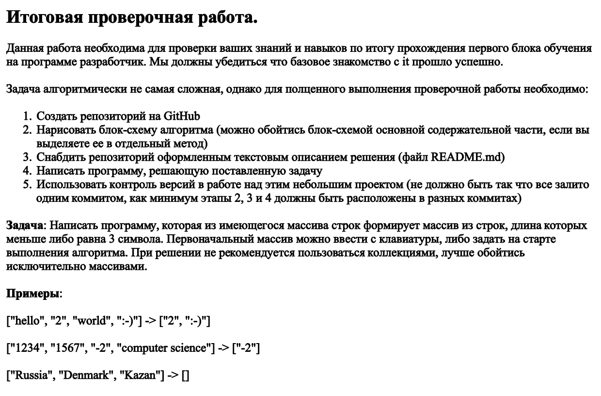

# Решение задачи
Создадим функцию, которая будет собирать массив слов, состоящих из **3-х или меньше символов.**

Идея такая:

    Проходясь по словам в заданном массиве, 
    мы проверяем каждое слово на его длину, 
    и если оно меньше или равно 3 трём, то добавляем 
    в результирующий массив.

Изменять размер мы можем с помощью команды `Array.Resize`

---

Я изначально думал что этот метод будет более разумным чем создание пустого массива с уже заданным размером. Потому что нам бы пришлось делать проверки изначального массива дважды
1. чтобы узнать сколько слов имеет **3 или меньше символов** и указать это значение в размер результирующего массива.
2. чтобы добавлять в **результирующий массив** слова с **3-мя или меньше символами**

---

* с помощью цикла `foreach` (потому что нам не важен индекс) проходимся по словам изначального массива
* с помощью `if (array_name.Lenght <= 3)` проверяем, состоит ли слово из **3-х или меньше символов**. Если да то...
    1. увеличиваем размер **результирующего массива** на 1. `Array.Resize(ref result, result.Length + 1);`
    2. добавляем в последнюю ячейку **результирующего массива** слово из текущего прогона цикла.

* возвращаем **результирующий массив**
